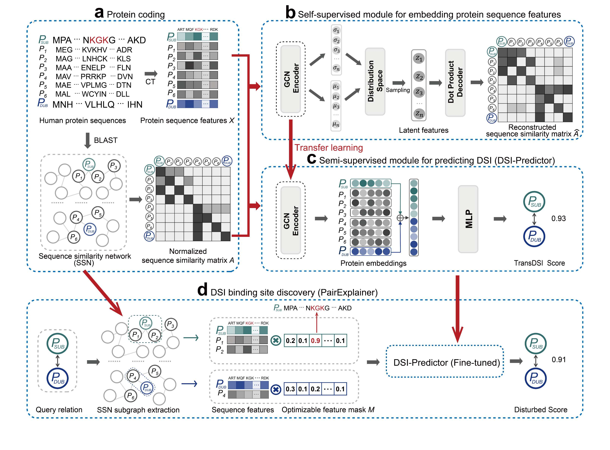

<h1 align="center">DeepDSI</h1>


<!-- TABLE OF CONTENTS -->
<details open="open">
  <summary><h2 style="display: inline-block">Table of Contents</h2></summary>
  <ol>
    <li>
      <a href="#about-the-project">About The Project</a>
    </li>
    <li>
      <a href="#getting-started">Getting Started</a>
      <ul>
        <li><a href="#dependencies">Dependencies</a></li>
        <li><a href="#installation">Installation</a></li>
        <li><a href="#folders">Folders</a></li>
      </ul>
    </li>
    <li>
      <a href="#usage">Usage</a>
      <ul>
        <li><a href="#dsi-prediction">DSI prediction</a></li>
        <li><a href="#dsi-binding-site-inference">DSI binding site inference</a></li>
      </ul>
    </li>
    <li>
      <a href="#available-data">Available Data</a>
      <ul>
        <li><a href="#gold-standard-dataset-gsd">Gold Standard Dataset (GSD)</a></li>
        <li><a href="#benchmark-dataset">Benchmark Dataset</a></li>
        <li><a href="#predicted-dsi-dataset-pdsid">Predicted DSI Dataset (PDSID)</a></li>
      </ul>
    </li>
  </ol>
</details>


## About The Project
 

DeepDSI is a novel, sequence-based _ab initio_ method that leverages explainable graph neural networks and transfer learning for deubiquitinase-substrate interaction (DSI) prediction. DeepDSI transfers intrinsic biological properties learned from protein sequences to predict the catalytic function of DUBs, leading to a significant improvement over state-of-the-art feature engineering methods and enabling the discovery of novel DSIs. Additionally, DeepDSI features an explainable module, allowing for accurate predictions of DSIs and the identification of binding regions.

 - DeepDSI is described in the paper [“A deep learning framework for protein sequence-based deubiquitinase-substrate interaction identification”](https://github.com/Laboratory-of-biological-networks/DeepDSI) by Yuan Liu, Dianke Li, Xin Zhang, _et al_.


## Getting Started
To get a local copy up and running, follow these simple steps

### Dependencies
DeepDSI is tested to work under Python 3.7.
The required dependencies for DeepDSI are  [Pytorch](https://pytorch.org/), [PyG](https://pytorch-geometric.readthedocs.io/en/latest/) and [scikit-learn](http://scikit-learn.org/).
Check environments.yml for list of needed packages.

### Installation

1. Clone the repo
   ```sh
   git clone https://github.com/Laboratory-of-biological-networks/DeepDSI.git
   ```
2. Create conda environment for DeepDSI
   ```sh
   conda env create -f environment.yml
   ```
3. Based on your use, you may need to download data

   Datasets (validation and test) and features for training DeepDSI are provided in [DeepDSI data(~82M)](https://www.zenodo.org/record/7648337/files/data.tar.gz?download=1)

   Uncompress `tar.gz` file into the DeepDSI directory
   ```sh
   tar -zxvf data.tar.gz -C /path/to/DeepDSI
   ```

### Folders
./src contains the implementation for the fivefold cross-validations and independent tests of DeepDSI and Baselines.

./preprocessing contains the selection of gold standard dataset and the coding of protein sequence features and similarity matrix.

./explain contains the invoking of PairExplainer, which is used to analyze the explainability of the queried DSI.

./results contains DeepDSI prediction results, explainable analysis results, and trained DeepDSI model.

## Usage

### DSI prediction
To predict Deubiquitinase substrate interaction (DSI) use `run_DSIPredictor.py` script with the following options:

* `dub`             str, Uniprot ID of the queried DUB
* `candidate_sub`            str, Uniprot ID of the candidate substrate corresponding to the queried DUB
* `model_location`             str, DSIPredictor model file location

#### Example: obtaining the DeepDSI score of [USP10-MDM2](https://www.sciencedirect.com/science/article/pii/S2211124722012761)

```
>> python run_DSIPredictor.py --dub Q14694 --candidate_sub Q00987
OR
>> python run_DSIPredictor.py -d Q14694 -s Q00987
```

#### Output:

```txt
Collect embeddings
100%|███████████████████████████████████████████████████| 20398/20398 [00:10<00:00, 1993.32it/s]
Calculate the sequence similarity matrix
100%|█████████████████████████████████████████████| 3383863/3383863 [00:05<00:00, 598758.94it/s]
Transferred model and data to GPU
The DeepDSI score of Q14694 and Q00987 is 0.9987.
```

### DSI binding site inference
To investigate the regions of the input DUB and/or candidate SUB sequence that contribute the most to the interaction

use `run_PairExplainer.py` script with the following options:

* `feat_mask_obj`             str, The object of feature mask that will be learned (`dsi` - DSI, `dub` - DUB, `sub` - SUB)
* `dub`             str, Uniprot ID of the queried DUB
* `candidate_sub`            str, Uniprot ID of the candidate substrate corresponding to the queried DUB
* `model_location`             str, DSIPredictor model file location
* `output_location`             str, PairExplainer output file location
* `lr`             float, The learning rate to train PairExplainer
* `epochs`             int, Number of epochs to train PairExplainer
* `log`             bool, Whether or not to print the learning progress of PairExplainer

#### Example: obtaining the PairExplainer results of USP10-MDM2

```
>> python run_PairExplainer.py --feat_mask_obj dsi --dub Q14694 --candidate_sub Q00987 --output_location results/importance/
OR
>> python run_PairExplainer.py -obj dsi -d Q14694 -s Q00987
```

#### Output:

```txt
Collect embeddings
100%|███████████████████████████████████████████████████| 20398/20398 [00:10<00:00, 1940.45it/s]
Calculate the sequence similarity matrix
100%|█████████████████████████████████████████████| 3383863/3383863 [00:05<00:00, 602453.09it/s]
Transferred model and data to GPU
importance this pair of DSI: 100%|████████████████████████| 10000/10000 [06:49<00:00, 24.43it/s]
The explainable result of Q14694 and Q00987 is saved in 'results/importance/Q14694_Q00987.csv'.
```

## Available Data

* #### [Gold Standard Dataset (GSD)](https://github.com/Laboratory-of-biological-networks/DeepDSI/raw/master/Supplemental_Files/Supplementary%20Table%20S1.xlsx)
DeepDSI has established a rigorous gold standard dataset where the positive set is sourced from [UBibroswer 2.0](http://ubibrowser.bio-it.cn/ubibrowser_v3/) and negative set is derived from [BioGRID](https://thebiogrid.org/). We divided GSD into the cross-validation dataset and the independent test dataset in chronological order.

We also provide **Gold Standard Positive Set (GSP) with inferred binding sites**, please [click](https://github.com/Laboratory-of-biological-networks/DeepDSI/raw/master/Supplemental_Files/Supplementary%20Table%20S2.xlsx) to download.

* #### [Benchmark Dataset](https://github.com/Laboratory-of-biological-networks/DeepDSI/tree/master/results/roc)

To ensure fair comparison, cross-validation dataset and independent test dataset are intersected with the corresponding datasets from [UbiBrowser 2.0](http://ubibrowser.bio-it.cn/ubibrowser_v3/home/download).

Click to download the [cross-validation results](https://github.com/Laboratory-of-biological-networks/DeepDSI/blob/master/results/roc/UB2_DeepDSI_CTMLP_crossval.csv) and the [independent test results](https://github.com/Laboratory-of-biological-networks/DeepDSI/blob/master/results/roc/UB2_DeepDSI_CTMLP_indtest.csv).

* #### [Predicted DUB-Substrate Interaction Dataset (PDSID)](https://github.com/Laboratory-of-biological-networks/DeepDSI/raw/master/Supplemental_Files/Supplementary%20Table%20S3.xlsx)
DeepDSI was used to performed a large-scale proteome-wide DSI scanning, resulting in a predicted DUB-substrate interaction dataset (PDSID) with 19,461 predicted interactions between 85 DUBs and 5,151 substrates.

We also provide **PDSID with inferred binding sites**, please [click](https://zenodo.org/record/7949804/files/Supplementary%20Table%20S3.xlsx?download=1) to download.
